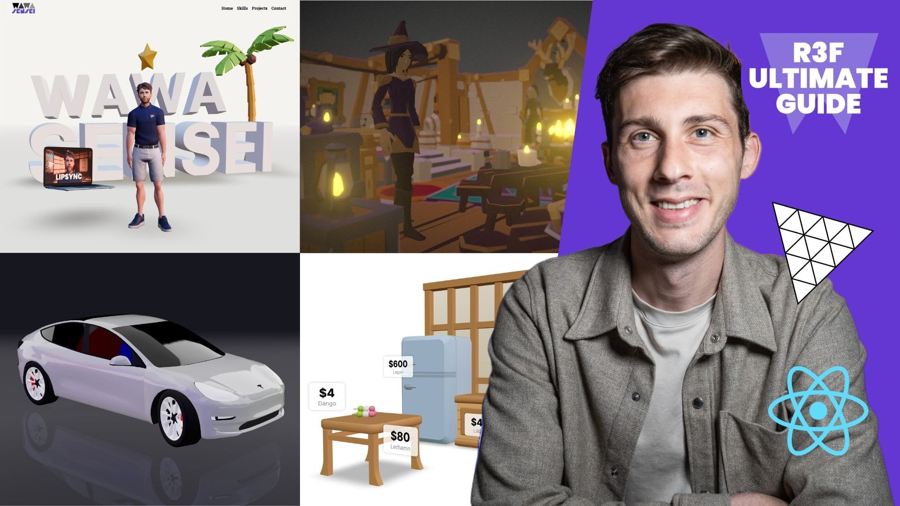
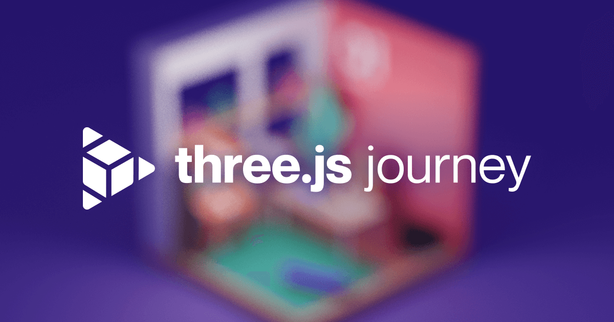

# Triplex for [SydJS](https://sydjs.com)

Today we're going to build a user interface in 3D! Knowledge of React Three Fiber not needed.

Here's some references to what we're going to be using.

- [React Three Fiber](https://github.com/pmndrs/react-three-fiber)
- [uikit](https://github.com/pmndrs/uikit)
- [VS Code](https://code.visualstudio.com/)
- [Triplex](https://triplex.dev)
- [Talsho Login Screens](https://dribbble.com/shots/16120339-Talsho-Login-Screens) design by Kailash Saravanan

## Get Started

This workshop assumes you're using VS Code.

1. Clone this repository
1. Install dependencies (preference: pnpm)
1. Install [Triplex for VS Code](https://marketplace.visualstudio.com/items?itemName=trytriplex.triplex-vsce)

You're ready. Follow along!

## Press Enter To Continue...

When you want to continue learning, here's some handy links.

- [Learn more Triplex](https://github.com/try-triplex/triplex) 
  - [Join Discord](https://discord.gg/nBzRBUEs4b) — Join the Triplex community
  - [Learn the User Interface](https://triplex.dev/docs/get-started/user-interface) —
    A quick orientation around the editor
  - [Project Settings](https://triplex.dev/docs/get-started/settings) — Learn how
    to configure the editor to your needs
  - [Declaring Props](https://triplex.dev/docs/get-started/declaring-props) —
    Learn how declaring props on your components will appear in the editor
- [Join the React Three Fiber (pmndrs) Discord](https://discord.com/invite/poimandres)
- [Learn from Wawa Sensei](https://lessons.wawasensei.dev/courses/react-three-fiber) 
- [Learn from Three.js Journey](https://threejs-journey.com) 
